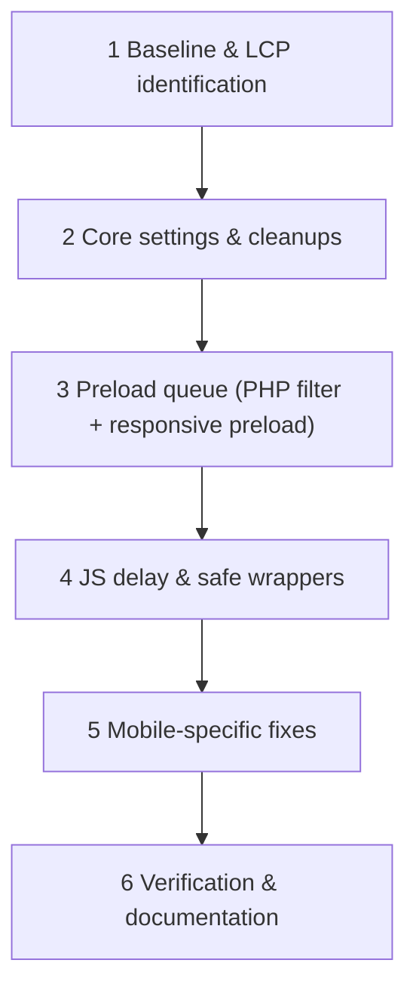

# WordPress PageSpeed Playbook

## 0. Targets (realistic and measurable)
| Metric | "Good" (Google, field data) | Stretch goal (lab) |
|--------|----------------------------|--------------------|
| LCP | ≤ 2.5 s | < 1.5 s |
| INP (replaced FID) | ≤ 200 ms | < 100 ms |
| CLS | ≤ 0.1 | 0 |
| TBT (lab proxy for INP) | < 200 ms | 0 ms |
| PSI mobile / desktop | > 90 | > 95 |

Lab scores fluctuate ±5. Always judge by **median of 3 runs** plus **CrUX/Search Console field data** when available. `TBT = 0` and `LCP < 1.5 s` are stretch goals, not pass/fail gates.

## 1. Workflow


## 2. Common problems
1. **FlyingPress preload bloat** — entrance animations make the optimizer treat 20+ images as critical.
2. **Slider autoplay hurting LCP** — excluding slider JS from delay lets autoplay run during load.
3. **`splideInstanceHandler is not defined`** — inline Bricks interaction code runs before delayed Bricks core.
4. **Blank above-the-fold** — entrance animation classes + delayed animation script.
5. **Too many above-the-fold requests on mobile** — image grids/query loops.

## 3. Global AI prompt (copy-paste)
```text
You are a senior WordPress performance engineer. Goal: pass Core Web Vitals on mobile and desktop
(LCP ≤ 2.5 s, INP ≤ 200 ms, CLS ≤ 0.1; stretch: PSI > 95, LCP < 1.5 s, TBT ≈ 0).

Stack: Bricks Builder, FlyingPress (cache, JS delay, CSS), Scripts Organizer or child theme,
Perfmatters (Script Manager), hosting: [Cloudways/other], PHP [version].

Rules:
- Ask for a baseline first (PSI mobile + desktop URLs, LCP element, waterfall) before proposing changes.
- Change ONE variable at a time, re-measure, and log result (before → after).
- Identify the LCP element per viewport. Preload ONLY the logo (if above the fold) and the viewport-specific LCP image,
  using <link rel="preload" as="image" media="..." fetchpriority="high">. The preloaded URL must match the URL the browser picks.
- Never lazy-load the LCP image. Give every image width/height.
- Strip bloated auto-preloads via FlyingPress output filter (PHP 8.2-safe, no DOMDocument HTML-ENTITIES).
- Keep Bricks core + slider scripts delayed; wrap inline code that depends on them in a bounded polling helper.
- No entrance animation above the fold.
- Provide code that is escaped, prefixed, PHP 8.2+ compatible, and marked with where it must be placed.
- Flag any vendor hook/setting name you are not certain exists in the installed plugin version.
Output: ordered action list, code, expected impact, and how to verify each step.
```

## 4. Implementation steps

### Step 1 — Baseline
- Run PSI (mobile & desktop) × 3 on **logged-out, cache-warm** pages; save LCP element, waterfall and score.
- Record hosting stack: PHP version (8.2+), object cache (Redis) on, no duplicate caching layers (disable Breeze/other page-cache plugins when FlyingPress is active).

### Step 2 — Bricks settings
Bricks → Settings → Performance: **CSS loading = External files**, **Disable emojis = ON**, **Disable WP embeds = ON**. Also consider disabling unused Bricks elements/features and Gutenberg block CSS (if Bricks only).

### Step 3 — Clean up FlyingPress preload bloat (PHP)
Place in Scripts Organizer (Frontend, `init`/`plugins_loaded`) or a mu-plugin. ⚠ VERIFY the hook name `flying_press_optimization:after` against your installed FlyingPress version.
```php
/**
 * FlyingPress: keep only allow-listed image preloads.
 * Regex-based on purpose: avoids DOMDocument re-serializing the whole page
 * and the deprecated mb_convert_encoding(..., 'HTML-ENTITIES') (PHP 8.2+).
 */
add_filter( 'flying_press_optimization:after', function ( $html ) {
    if ( is_admin() || wp_doing_ajax() || is_feed() || ! is_string( $html ) ) {
        return $html;
    }
    // Adjust per project: partial filenames of the logo and the LCP hero images.
    $allowed = apply_filters( 'ddc_preload_allowlist', [ 'logo', 'hero-desktop', 'hero-mobile' ] );

    $out = preg_replace_callback( '#<link\b[^>]*>#i', function ( $m ) use ( $allowed ) {
        $tag = $m[0];
        $is_img_preload = preg_match( '/\brel=["\']preload["\']/i', $tag )
                       && preg_match( '/\bas=["\']image["\']/i', $tag );
        if ( ! $is_img_preload ) {
            return $tag;                       // not an image preload → untouched
        }
        foreach ( $allowed as $needle ) {
            if ( stripos( $tag, $needle ) !== false ) {
                return $tag;                   // allowed
            }
        }
        return '';                             // remove
    }, $html );

    return $out ?? $html;                      // preg error → return original
}, 99 );
```

### Step 4 — Responsive hero preload (homepage only, in `<head>`)
```html
<link rel="preload" as="image" href="/wp-content/uploads/hero-mobile.webp"
      media="(max-width: 767px)" fetchpriority="high">
<link rel="preload" as="image" href="/wp-content/uploads/hero-desktop.webp"
      media="(min-width: 768px)" fetchpriority="high">
```
- The preload URL must be **identical** to the `src` the browser selects; if the `` uses `srcset`, use `imagesrcset` + `imagesizes` on the preload instead, otherwise the image downloads twice.
- The actual LCP `` gets `fetchpriority="high"` and **no** `loading="lazy"`.

### Step 5 — FlyingPress JS delay
1. Keep Bricks core and slider scripts **delayed** (don't exclude `bricks.min.js` / `splide.min.js`) — default.
2. Exclude only what must run immediately (e.g., critical above-the-fold script).
3. *Exception path:* if you must keep above-the-fold entrance animations → see Step 8 (decision tree).

### Step 6 — Safe wrapper for code depending on delayed libraries
```javascript
/** Run cb when check() is true; poll every 50 ms, give up after 5 s. */
function ddcWhenReady(check, cb, { interval = 50, timeout = 5000 } = {}) {
  if (check()) return cb();
  const start = performance.now();
  const id = setInterval(() => {
    if (check()) { clearInterval(id); cb(); }
    else if (performance.now() - start > timeout) {
      clearInterval(id);
      console.warn('ddcWhenReady: dependency not available after', timeout, 'ms');
    }
  }, interval);
}

function yourCustomFeature(e) {
  const el = e?.target;
  if (!el) return;

  const runLogic = () => {
    // const splide = window.bricksData?.splideInstances?.[el.getAttribute('data-script-id')];
  };

  ddcWhenReady(
    () => typeof splideInstanceHandler !== 'undefined',
    () => splideInstanceHandler(runLogic)
  );
}
```
Polling is the fallback; if the vendor exposes a "scripts loaded" event, prefer it.

### Step 7 — Mobile LCP: heavy grids / query loops above the fold
1. Create one combined collage image for mobile.
2. **Do not** rely on `display:none` to hide an *eager* image on desktop — hidden eager images are **still downloaded**. Instead use `<picture>` with `<source media="(max-width:767px)">` (Code element) or a Bricks condition so only one image is requested per viewport.
3. Hide the original grid on the mobile breakpoint (`display:none !important` in element CSS if class CSS overrides it).
4. Verify in DevTools → Network (throttled) that **desktop does not request the mobile collage and vice versa**.

### Step 8 — Animations: decision tree
```
Above-the-fold entrance animation needed?
├─ No  → (gold standard) remove it. Keep JS delay fully on.
└─ Yes → exclude from delay: fancy-animations, bricksforge, bricks.min.js
         → accept LCP cost, re-measure, document the decision in README.
```
Fancy Animations settings: **Optimized CSS file = ON** after development; **Minimum screen size ≥ 769 px** (disables on mobile).

### Step 9 — Script Manager micro-optimizations (Perfmatters)
Disable *globally* only after confirming the feature isn't used; prefer per-URL rules when unsure.
- `brxc-scroll-timeline` (JS) — if Advanced Themer scroll animations unused (~60 KB).
- `color-scheme-switcher-frontend` (JS/CSS) — no frontend light/dark toggle.
- `automaticcss-gutenberg` (CSS) — Gutenberg disabled and Bricks-only.
Retest forms, sliders, popups and menus after each rule.

### Step 10 — Fonts, CLS, third parties (new)
- Self-host WOFF2, subset, preload only the 1–2 above-the-fold weights, `font-display: swap` (or `optional`), size-adjusted fallback to cut CLS.
- Reserve space for embeds, ads, cookie banners; set `aspect-ratio` on media.
- Delay GTM/analytics/chat widgets until interaction; remove unused tags.
- Convert images to WebP/AVIF; serve through CDN; correct `sizes`.

## 5. Verification & documentation
- [ ] PSI mobile + desktop ×3 (median), cache warm, logged-out.
- [ ] WebPageTest (throttled mobile) — compare waterfall to baseline.
- [ ] Console clean (no `ReferenceError`), sliders/menus/forms/popups work with delay on.
- [ ] Test in Safari iOS + Chrome Android.
- [ ] Before → after table saved in the project README (LCP, TBT/INP, CLS, page weight, requests).
- [ ] Rollback note: which FlyingPress/Perfmatters settings changed.
- [ ] Re-check after every Bricks/FlyingPress major update.

## Definition of Done
Core Web Vitals "Good" in lab and, once data accrues, in field · no console errors · LCP element correctly preloaded once · decisions documented.
